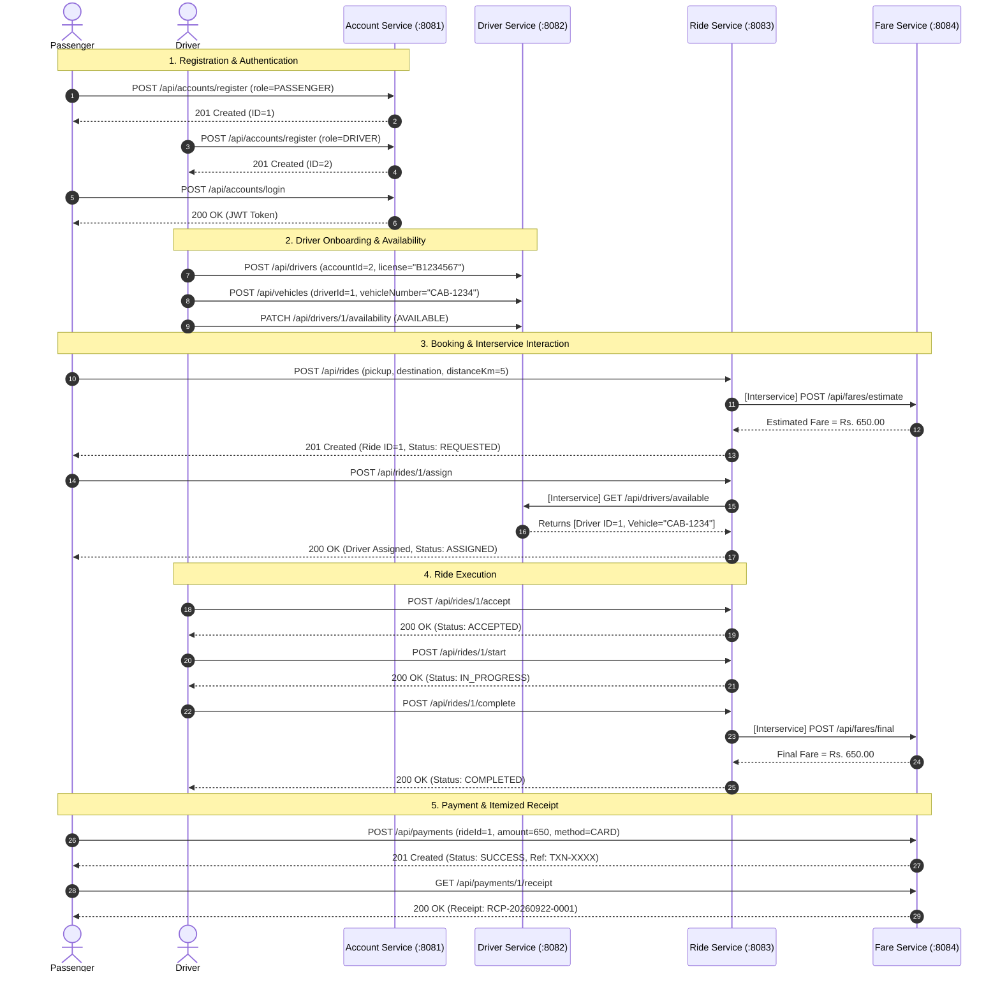
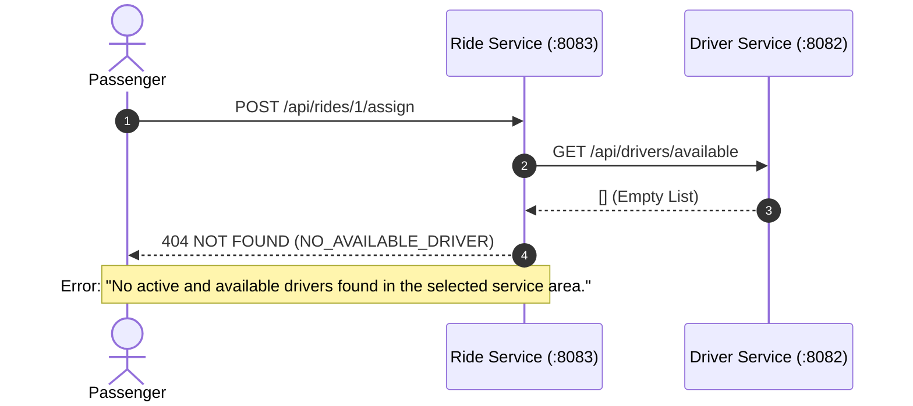
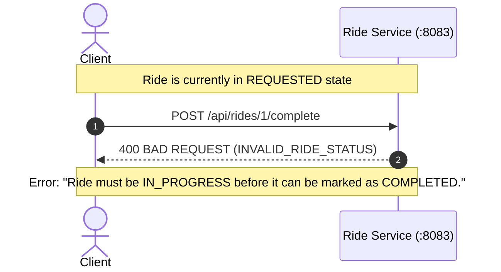

# RideLink Sequence Workflows & Failure Handling

## 1. End-to-End Successful Ride Lifecycle Sequence

---

## 2. Negative Scenario Sequences

### Negative Scenario 1: No Available Driver
When a passenger requests driver assignment, but all registered drivers are either `BUSY` or `UNAVAILABLE`:

### Negative Scenario 2: Invalid Ride State Transition
When a client attempts an illegal state transition (e.g. attempting to jump from `REQUESTED` directly to `COMPLETED` without driver acceptance or trip progress):

